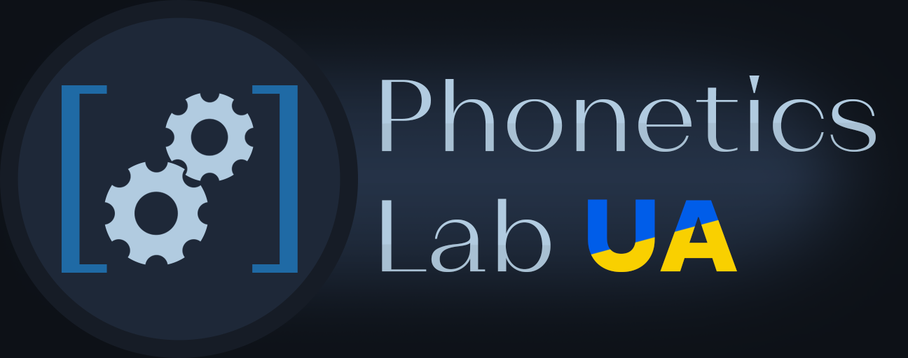

Створений студентом 2 курсу ОП "Прикладна (комп'ютерна) лінгвістика та англійська мова" Навчально-наукового інституту філології Київського національного університету імені Тараса шевченка в рамках виконання курсової роботи.

Інструмент для автоматичного фонетичного та фонематичного транскрибування слів української мови. Транскрибування відбувається динамічно, тому програма здатна опрацьовувати навіть вигадані слова, за наявності в них наголосу.

Метою було створити доступний інструмент для автоматизації фонетичного/фонематичного аналізу слів, у майбутньому — текстів. ПЗ стане в нагоді при вивченні української як іноземної, а в перспективі і в галузі синтезу усного мовлення.

# Використання застосунку

Цей розділ слугує пам'яткою користувачеві при використанні програмного забезпечення.

1. Наразі транскриптор оброблює слова по одному. Робота над токенізацією фонетичних слів планується в недалекому майбутньому.
2. Використовуйте кириличні літери. Програма не транслітерує текст, введений латинкою
3. Наголоси в словах, за можливості, визначаються автоматично. Якщо наголос не відповідає дійсності (омонімія, слово поза словником), позначте наголос символом відсотка, наприклад: квазіомонімі%я

# Проблеми

У разі неправильної роботи програми, чи неточності у транскрипції відкривайте тему в Issues та повідомляйте. Ваш зворотній зв'язок є невід'ємною частиною для покращення даного проєкту.

Відомі неточності при транскрибуванні:
- злиття звуків [д] та [з], коли вони не є частиною [д͡з] (наприклад, на морфемному шві);
- відсутність стягнення приголосних у словах іншомовного походження;
